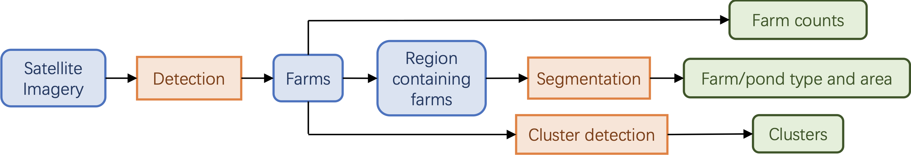
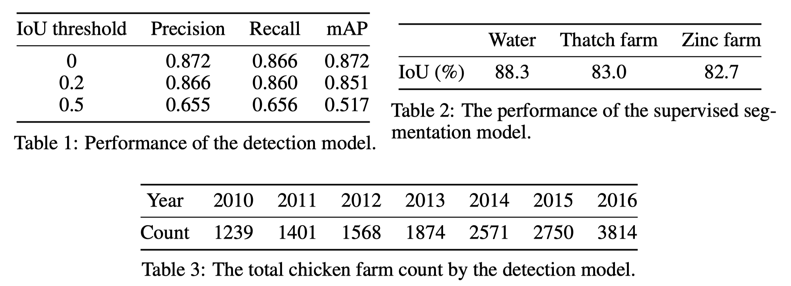

# Yangon Chickenfish

本项目是一个基于YOLOv4的卫星图像目标体识别与集群检测模型。

- 参考的PyTorch+YOLOv4实现：https://github.com/WongKinYiu/PyTorch_YOLOv4


## 1 模型

### 1.1 工作流程



如图所示。输入某地理范围内所有卫星图片后，首先全部裁剪成固定大小，通过检测模型，检出所有鸡鱼农场。然后，进行以下的统计：(1)计数，(2)重新以检出农场为中心裁剪卫星图片，通过分割模型，分割出农场与鱼塘的轮廓，计算总面积，(3)通过集群检测算法，统计农场集群。

### 1.2 算法

- detection: 基于YOLOv4。预测所有农场，结果格式为所有农场的经纬度位置，以及bounding box的长宽。可从头训练，支持水体检测预处理，支持基于经纬度的NMS去重，可自动计算anchor。

- segmentation：基于U-net。预测图片中属于水体的像素，以及图片中属于农场屋顶的像素，其中对于后者，同时预测农场的材料，材料分为草质与金属质两类。

- cluster detection：相互之间距离不超过距离D的农场被认为属于同一集群。

### 1.3 模型表现



- Table 1: detection模型表现，由精确率、召回率、平均精确率表示。表格列举了三个不同IoU阈值下的表现。IoU阈值为预测的bounding box与真实的bounding box之间的最大交-并比。

- Table 2: segmentation模型表现。由预测结果和真实结果间的交-并比表示。

- Table 3: 2010～2016年，模型对仰光周围100km半径内农场总个数的计数结果。

更详细的模型相关信息，请参考files/report.pdf。


## 2 安装

```
pip install -r requirements.txt
```
- 安装mish-cuda：https://github.com/thomasbrandon/mish-cuda


## 3 运行

### 3.1 数据准备

- src/detection/images: 裁剪为固定大小后的卫星图片
- src/detection/annotations: 对应的json标注文件

预处理训练数据：
```
cd src/detection/;
python preprocess/preprocess_train.py;
```

### 3.2 detection
训练：
```
cd src/detection/;
bash scripts/train.sh;
```

测试：
```
cd src/detection/;
bash scripts/test.sh;
```

预测：
```
cd src/detection/;
python preprocess/preprocess_detect.py;
bash scripts/detect.sh;
```

### 3.5 cluster detection
detection的结果需先放至 src/cluster_detection/raw/ 目录下。
```
cd src/cluster_detection/;
python nms.py;
python detect.py;
```

输出格式：
```
...
cluster 
k xmin ymin xmax ymax
xmin_1 ymin_1 xmax_1 ymax_1
xmin_2 ymin_2 xmax_2 ymax_2
...
xmin_k ymin_k xmax_k ymax_k
cluster
...
```

### 3.6 segmentation
训练：
```
cd src/segmentation/;
python main.py;
```

预测：
```
cd src/segmentation/;
python make_buffer.py;
python inference.py;
python post_process.py;
```

输出格式：
```
...
farm_id, material, roof_size, whether_in_water, water_area, neighbor_ids
...
```

